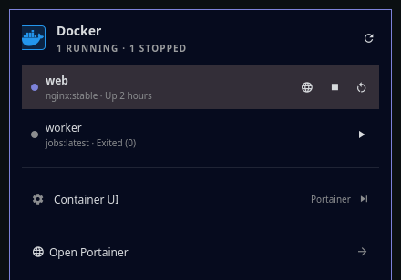

# Docker widget for Omarchy



A native-looking Omarchy bar widget for monitoring and controlling Docker
containers.

## Features

- Docker logo and daemon status in the bar.
- Running and stopped container counts.
- List of all containers, with image and status.
- Open the first published TCP service of a running container from its browser
  button. Specific bind addresses are preserved; wildcard bindings are offered
  automatically only for the local `default` context. Named local contexts can
  set an explicit published-service host; named remote contexts default to no
  wildcard links.
- Start, stop, and restart controls.
- Configurable Docker context.
- On-demand refresh: Docker is queried only when the panel opens, after an
  action, when an already-loaded context changes, or when refresh is explicitly
  requested.
- Serialized state-changing actions with state-aware controls and timeouts.
- Last-known container state remains visible when Docker becomes unavailable;
  controls stay disabled until a valid refresh succeeds.
- Configurable link to Portainer, Dockge, a custom UI, or no UI.
- Explicit mouse controls for state-changing actions; typing while the panel
  has focus cannot start, stop, or restart a container.

## Requirements

- The Docker CLI must be on `PATH`.
- The desktop user must have permission to access the selected Docker context.
  The widget never elevates privileges or stores credentials.
- When the system daemon denies access, the panel can open Omarchy's official
  Sudoless Docker security wizard. The wizard clearly warns that membership in
  the `docker` group is equivalent to passwordless root and requires a reboot.

## Install

Place this directory under `~/.config/omarchy/plugins/` and enable it:

```bash
omarchy plugin enable juan.docker --section right
```

## Development checks

```bash
./test                       # schema, QML lint, and unit tests
./test-behavioral            # headless Quickshell process/race tests
./test-integration default   # read-only check against a real Docker context
```

The integration check requests only the six fields displayed by the widget
and verifies that the container ID set is unchanged before and after the run.
It never starts, stops, restarts, creates, or removes a container.

Docker does not expose application-protocol metadata in `docker ps`. Published
container ports 443, 8443, and 9443 are inferred as HTTPS; other published TCP
ports are inferred as HTTP. Only the first candidate is opened, preventing one
click from launching an unbounded number of browser tabs. UDP, ranges, stopped
containers, internal-only ports, and wildcard bindings on named contexts are
not offered automatically.
